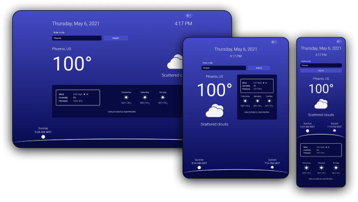
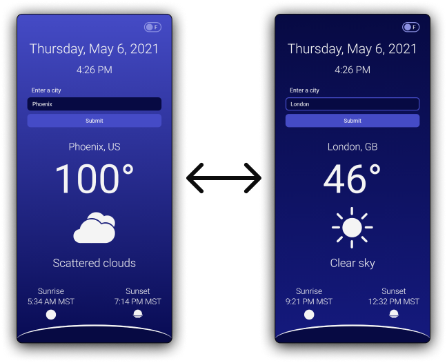

# Weather React App

    

    
    

Displays the current weather and 3-day forecast of any city entered, in addition to the city's sunrise and sunset, displayed in local time.

The data is fetched from [OpenWeather](https://openweathermap.org/), using the [Current Weather Data API](https://openweathermap.org/current) and [5 Day / 3 Hour Forecast API](https://openweathermap.org/forecast5).

## Features

-   Ability to enter any city
-   Displays current temperature
-   A toggle to switch between Fahrenheit and Celsius
-   Displays current weather
-   Displays sunrise and sunset in the user's local time
-   Displays a 3-day forecast
-   Theme changes if it's daytime or nighttime in the current city

    

## Technologies Used

-   [React](https://reactjs.org/)
-   [styled-components](https://styled-components.com/)

## Installation

You will need [Node and npm](https://nodejs.org/en/) installed to run this project. You will also need your own API key from OpenWeather.

Clone the project and run `npm install` in the root directory.

To learn React, check out the [React documentation](https://reactjs.org/).

## Running in Development Mode

`npm start`

Runs the app in the development mode. Open [http://localhost:3000](http://localhost:3000) to view it in the browser.

## Testing

`npm test`

Launches the test runner in the interactive watch mode. See the section about [running tests](https://facebook.github.io/create-react-app/docs/running-tests) for more information.

## Building

`npm run build`

Builds the app for production to the `build` folder. It correctly bundles React in production mode and optimizes the build for the best performance.
